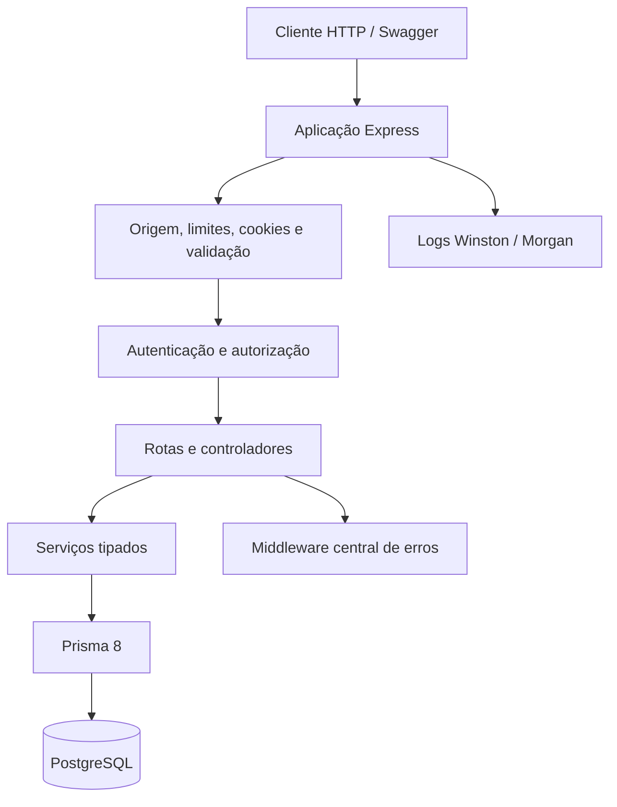

<!-- Documento: README.md -->

# 🚀 API com Express, TypeScript e Prisma 8

**Um guia progressivo para construir, testar e documentar uma API PostgreSQL.**


> **📌 Importante**
>
> Este README orienta a **reconstrução em uma pasta nova**. A aplicação existente em `src/`, suas migrações e seu `package.json` não são automaticamente convertidos pelos exemplos. Siga os capítulos para construir a API do guia; não execute `orm init` sobre o projeto existente.

## 🧭 Comece aqui

Uma **API** é um programa que recebe pedidos e devolve respostas. Neste guia, ela recebe pedidos para cadastrar e consultar usuários, conversar com o banco e fazer login. Você vai montar esse programa em partes; não precisa conhecer Prisma, JWT ou Swagger antes de começar.

1. Confira Node.js 24.15.0 ou posterior compatível e npm 11.
2. Prepare um banco PostgreSQL 15 ou superior **vazio**, local ou Neon, exclusivo para desenvolvimento.
3. Abra o CMD no diretório que conterá uma pasta nova `api`.
4. Siga [01 · Preparação do ambiente](docs/01-prepacao-do-ambiente.md).
5. Avance somente depois de concluir a lista de conferência do capítulo.

Se `api` já existe, use outro diretório pai ou outra pasta vazia. No PowerShell, comandos npm podem precisar de `npm.cmd`/`npx.cmd`, sem alterar a política de execução.

O [`.env.example`](.env.example) contém o mesmo modelo público do capítulo 1. Copie os valores necessários para o `.env` da **nova API**, preenchendo a conexão e gerando uma chave JWT própria. Se pretende aproveitar tabelas e um contrato existentes, leia a alternativa de adoção no [capítulo 2](docs/02-modelagem-e-sincronizacao-com-prisma.md); os campos do banco precisam corresponder aos serviços e ao gerador.

## 📝 Como acompanhar os exemplos

| Quando o guia mostrar… | O que você deve fazer |
|---|---|
| **Arquivo: `src/config/env.ts`** | Dentro da pasta da API, abra `src`, depois `config`, e crie ou abra `env.ts` no editor |
| **Crie este arquivo** | Crie também as pastas do caminho que ainda não existirem e copie o bloco completo |
| **Substitua todo o conteúdo** | Apague o conteúdo do arquivo indicado e cole o novo bloco; não acrescente uma segunda versão ao final |
| **Somente o campo `scripts`** | Edite essa parte de `package.json` e preserve o restante do arquivo |
| Um bloco de comandos CMD | Digite uma linha por vez no terminal, na pasta indicada; não cole comandos dentro de um arquivo TypeScript |
| Um resultado esperado | Confira a saída no terminal ou navegador antes de seguir para o próximo passo |

A **raiz da API** é a pasta que contém `package.json`: normalmente `api`, ou `api2`, `api3` etc. se você escolheu outro nome. Por exemplo, `prisma.config.ts` fica em `api/prisma.config.ts`; `src/prisma/db.ts` fica em `api/src/prisma/db.ts`.

O comentário `// Arquivo: …` identifica o exemplo e pode ser copiado junto. Arquivos de ambiente usam `#` como comentário. Os arquivos `tsconfig` aceitam JSON com comentários, destacado como `jsonc`. Já `package.json` não aceita comentários: por isso, seu caminho aparece **fora** do bloco JSON. A primeira linha do contrato Prisma continua sendo `// use prisma-8`; o caminho vem na linha seguinte.

Os cabeçalhos identificam os arquivos que você vai escrever a partir dos exemplos. Arquivos gerados automaticamente, como `contract.json`, `contract.d.ts` e `package-lock.json`, devem manter o formato produzido pelas ferramentas; não acrescente comentários manualmente a eles.

### Termos que aparecerão durante a construção

| Termo | Significado neste guia |
|---|---|
| Terminal / CMD | Janela onde você digita comandos e lê seus resultados |
| Dependência / pacote | Biblioteca instalada pelo npm para a aplicação ou as ferramentas usarem |
| TypeScript | Código com informações de tipos que ajudam a encontrar erros antes da execução |
| JSON | Formato de dados com campos e valores; usado em configurações e respostas da API |
| HTTP / rota | Forma de enviar pedidos e endereço que a API atende, como `GET /users` |
| CLI | Ferramenta usada no terminal; neste caso, os comandos do Prisma |
| ORM / Prisma | Ferramenta que permite consultar o banco a partir do código da aplicação |
| Contrato / migração | Descrição da estrutura desejada / mudanças aplicadas ao banco para chegar a essa estrutura |
| Middleware | Função executada antes ou depois do atendimento de uma rota, como validação ou tratamento de erros |
| Build / compilar | Converter os arquivos TypeScript de `src` em JavaScript na pasta `dist` |

Cada capítulo apresenta os termos específicos quando eles passam a ser necessários. Os números HTTP, como 200, 400 e 401, indicam o resultado de um pedido e são explicados junto dos testes.

## 📚 Trilha completa

| Etapa | Guia | Entrega e critério de avanço |
|---|---|---|
| 01 | [Preparação do ambiente](docs/01-prepacao-do-ambiente.md) | Dependências fixadas, ESM, ambiente validado e `/health` 200 |
| 02 | [Contrato e migrações](docs/02-modelagem-e-sincronizacao-com-prisma.md) | `User` emitido e migrado; banco verificado e build aprovado |
| 03 | [Rotas, serviços e controladores](docs/03-criando-rotas-serv-contro.md) | CRUD local, erros HTTP e respostas sem hash de senha |
| 04 | [Validação com Zod](docs/04-validacao-de-dados-com-zod.md) | Normalização aplicada, campos extras e entradas inválidas rejeitados |
| 05 | [JWT, autorização e cookies](docs/05-autenticacao-com-jwt.md) | Login por Bearer/cookie; cada usuário acessa a própria conta |
| 06 | [Logs com Winston e Morgan](docs/06-monitorizacao-e-logs-com-winston.md) | Logs HTTP e JSON, sem perder CORS ou cookies |
| 07 | [Segurança e limites](docs/07-seguranca-e-rate-limit.md) | Helmet, origens explícitas, preflight e limites de API/login |
| 08 | [Swagger e OpenAPI](docs/08-documentacao-com-swagger.md) | Operações públicas/privadas documentadas em desenvolvimento e após o build |
| 09 | [Testes automatizados](docs/09-testes-automatizados-vitest.md) | 17 testes sem banco e integração real em banco separado |
| 10 | [Gerador de recursos com Plop](docs/10-automacao-e-geracao-de-codigo.md) | CRUD `Cliente`, quatro arquivos gerados e seis testes adicionais |
| 11 | [Validação final e operação](docs/11-validacao-ponta-a-ponta.md) | 23 testes, banco, CRUD, cookies e execução compilada conferidos |

A ordem importa: emitir contrato não aplica tabelas, gerar código não cria modelos e compilar não confirma conexão com o banco.

## 🏗️ Arquitetura construída pelo guia



```text
api/
├── src/
│   ├── app.ts                  # Express importável pelos testes
│   ├── server.ts               # Porta HTTP e encerramento das conexões
│   ├── config/                 # Ambiente, logger e Swagger
│   ├── controllers/            # Entrada/saída HTTP
│   ├── lib/                    # HttpError
│   ├── middlewares/            # Validação, JWT, CORS, origem, limites e erros
│   ├── prisma/
│   │   ├── contract.prisma     # Fonte do contrato
│   │   ├── contract.json       # Gerado e versionado
│   │   ├── contract.d.ts       # Gerado e versionado
│   │   └── db.ts               # Cliente compartilhado
│   ├── routes/                 # Usuários, autenticação e clientes
│   ├── schemas/                # Zod e tipos de entrada
│   └── services/               # Banco e regras de negócio
├── migrations/                 # Migrações, snapshots e refs versionados
├── tests/                      # Testes sem banco e integração real
├── plop-templates/             # Quatro templates do recurso de contatos
├── plopfile.js                 # Gerador ESM
├── prisma.config.ts
├── tsconfig.json
├── vitest.config.ts
├── vitest.integration.config.ts
├── .env.example                # Placeholders públicos
├── .env                        # Segredos locais; ignorado
├── .env.test                   # Banco separado; ignorado
├── package.json
└── package-lock.json
```

`dist/`, `logs/`, `coverage/` e `node_modules/` são artefatos locais, não fontes versionadas.

## 🧰 Versões e convenções

| Escolha | Convenção |
|---|---|
| Prisma CLI | `8.0.0-rc.15` |
| ORM PostgreSQL | `@prisma/orm-postgres@8.0.0-rc.11` |
| Datas no Node.js 24 | `temporal-polyfill@1.0.5`; import global no cliente antes das consultas |
| CLI engine | `@prisma/cli-engine@0.4.0`, correspondente à CLI |
| TypeScript | `5.9.3`, `module` e `moduleResolution` em `NodeNext` |
| Módulos | `type=module`; imports locais com extensão `.js` |
| Contrato | Caminho único em `src/prisma/contract.prisma`; primeira linha `// use prisma-8` |
| Dependências | Versões exatas nos comandos; `package-lock.json` versionado |
| Ambiente | Segredo JWT obrigatório; origens HTTP(S) explícitas |

> **ℹ️ Observação**
>
> Prisma 8 está em versão candidata nesta combinação. Evite trocar pacotes por `latest` durante o exercício. CLI e ORM possuem numeração própria; use o conjunto de versões conferido neste guia, sem tentar igualar apenas os números finais de cada pacote.

## 🔐 Política de acesso

| Recurso | Regra |
|---|---|
| Cadastro e login | Públicos, validados e limitados |
| Conta `User` | Somente o próprio titular; sem hash nas respostas |
| Contatos `Cliente` | Compartilhados entre usuários autenticados neste exercício |
| Cookie em escrita | Origem confiável obrigatória nas rotas autenticadas |
| JWT | HS256, emissor/audiência definidos e duração de 15 minutos |
| Logout | Limpa cookie; cliente descarta Bearer; não revoga JWT já emitido |

O tutorial não implementa administrador, recuperação de senha, revogação imediata, refresh token ou permissões individuais sobre contatos. Esses recursos precisam de regras próprias antes de expandir o produto.

## ▶️ Comandos da API depois de construída

Estes scripts são configurados **durante o guia**, não necessariamente no código existente deste repositório:

| Comando | Uso |
|---|---|
| `npm run dev` | Desenvolvimento com `tsx watch` |
| `npm run typecheck` | Conferir TypeScript sem emitir arquivos |
| `npm run contract:emit` | Atualizar contrato JSON e tipos |
| `npm run skills:sync` | Sincronizar instruções para agentes |
| `npm test` | Executar testes sem banco real |
| `npm run test:coverage` | Gerar relatório de cobertura |
| `npm run test:integration` | Alterar e testar banco exclusivo em `.env.test` |
| `npm run generate` | Criar os quatro arquivos de um recurso de contatos |
| `npm run build` | Compilar para `dist/` |
| `npm start` | Executar o JavaScript compilado |

Após o capítulo 8, a interface fica em [http://localhost:3000/api-docs](http://localhost:3000/api-docs) e o documento em [http://localhost:3000/api-docs.json](http://localhost:3000/api-docs.json), salvo se você configurar outra porta/origem.

## ✅ Validação e seus limites

**Os onze capítulos foram executados em sequência em uma pasta nova (`api5`), com PostgreSQL real e bancos separados para desenvolvimento e integração, em 2 de outubro de 2026.** Passaram os 23 testes sem banco, o teste de integração, os CRUDs reais, o build, a execução sem dependências de desenvolvimento e a interação com Swagger e cookies no Edge. Naquela execução, os 40 arquivos finais identificados no Markdown foram comparados com os arquivos executados.

A revisão didática seguinte acrescentou identificação dos arquivos, avisos em português e explicações de cada passo. A lógica dos 40 arquivos foi comparada com a versão aprovada, e os exemplos com os novos cabeçalhos foram emitidos, gerados, compilados e testados novamente em uma cópia isolada. Veja as [evidências da revisão didática](docs/evidencias/2026-10-02-revisao-didatica.json).

Consulte o [registro da validação e suas evidências](docs/RELATORIO-DE-VALIDACAO.md). A aprovação se refere às versões e ao ambiente registrados; repita o [capítulo 11](docs/11-validacao-ponta-a-ponta.md) na sua própria instalação. Renderização no GitHub e publicação HTTPS não fizeram parte da execução local.

<details>
<summary>🛠️ Como ler e copiar os exemplos</summary>

- O nome do arquivo aparece acima do bloco e, quando o formato permite, no comentário inicial do código.
- Blocos de arquivo são completos, salvo quando explicitamente indicados como trechos do campo `scripts` ou modelos de ambiente a preencher.
- Blocos `bat` são comandos CMD executados linha por linha, sem numeração embutida.
- Listas de conferência são critérios de aprovação, não comprovantes de execução.
- Alertas destacam dependências e operações de banco; se uma verificação falhar, use o diagnóstico antes de avançar.
- Os nomes dos arquivos antigos foram preservados para manter os links existentes, inclusive `01-prepacao-do-ambiente.md`.

</details>

<details>
<summary>📦 Retomar uma cópia da API já construída</summary>

Com `package-lock.json`, contratos e migrações versionados, configure `.env` e execute:

```bat
npm ci
npm run typecheck
npm test
npm run build
```

Confira o banco e aplique migrações revisadas conforme o capítulo 11 antes de `npm start`. Não reinicialize o Prisma. O clone deste repositório didático pode conter uma aplicação de outra etapa; os comandos acima se referem à API concluída seguindo a documentação.

</details>

## 📖 Referências

[Prisma ORM](https://www.prisma.io/docs/orm/core-concepts) · [Express](https://expressjs.com/) · [TypeScript](https://www.typescriptlang.org/) · [Zod](https://zod.dev/) · [Vitest](https://vitest.dev/) · [Plop](https://plopjs.com/documentation/)

A apresentação usa recursos renderizados pelo GitHub: títulos e sumário, tabelas, blocos com realce de sintaxe, avisos em português, listas de tarefas, diagramas Mermaid, imagens de badges e seções recolhíveis. Os avisos usam citações e títulos em negrito para exibir **Atenção**, **Importante**, **Observação** e **Dica** em português. Não depende de JavaScript ou CSS personalizado.
