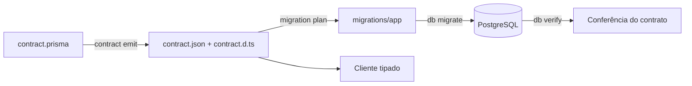

<!-- Documento: docs/02-modelagem-e-sincronizacao-com-prisma.md -->

# 02 · Contrato, banco e migrações

[← Anterior](01-prepacao-do-ambiente.md) · [Índice](../README.md) · **Etapa 2 de 11** · [Próxima →](03-criando-rotas-serv-contro.md)

**Ponto de partida:** conclua o capítulo anterior antes de continuar. Todos os caminhos abaixo partem da raiz da sua API, a pasta que contém `package.json`. Crie as subpastas indicadas no editor quando ainda não existirem.

## Resultado desta etapa

Um contrato `User` emitido, uma migração versionável, o banco verificado e o projeto compilável em ESM.



> **📌 Importante**
>
> Use o banco de desenvolvimento **vazio** configurado na etapa 1. `migration plan` não acessa o banco, mas `db migrate` altera sua estrutura. Não aplique este fluxo sobre tabelas existentes sem seguir a seção de adoção ao final.

## 1. Substituir o contrato inicial

**Propósito do passo:** O contrato descreve os campos de cada registro e as regras do banco. Vamos começar apenas com User, para aprender o ciclo completo antes de acrescentar outra tabela.

**Substitua todo o arquivo** `src/prisma/contract.prisma`, removendo os exemplos `User` e `Post` gerados pela CLI. Não acrescente outro modelo `User` ao que já existe.

**Arquivo: `src/prisma/contract.prisma`**

Substitua todo o conteúdo do arquivo existente. Descreve os modelos do banco. Preserve a primeira linha // use prisma-8: ela permite que o Prisma reconheça este contrato.

<!-- file: src/prisma/contract.prisma -->
```prisma
// use prisma-8
// Arquivo: src/prisma/contract.prisma

model User {
  id        Int      @id @default(autoincrement())
  email     String   @unique
  name      String?
  password  String
  createdAt DateTime @default(now())
}
```

Mantenha `// use prisma-8` como primeira linha. O contrato declara estrutura; não contém dados nem credenciais. `password` armazenará um hash bcrypt, nunca a senha enviada pelo usuário.

| Declaração | O que significa |
|---|---|
| `model User` | Define o tipo de registro de usuário que será armazenado |
| `id Int @id @default(autoincrement())` | Identificador inteiro, chave primária, com valor criado pelo banco |
| `email String @unique` | E-mail obrigatório que não pode se repetir em outro usuário |
| `name String?` | Nome opcional; `?` permite ausência de valor |
| `password String` | Campo obrigatório para guardar o hash da senha |
| `createdAt DateTime @default(now())` | Data e hora preenchidas pelo banco no cadastro |

Um **hash** é o resultado de transformar a senha com bcrypt. No login, a aplicação compara a senha recebida com esse resultado; não precisa guardar a senha original. Essa transformação será implementada no capítulo 3.

## 2. Substituir a configuração da CLI

**Propósito do passo:** Este arquivo informa à ferramenta de terminal do Prisma qual contrato ler e a qual banco se conectar. Ele fica na raiz da API, ao lado de package.json, e não dentro da pasta src.

**Arquivo: `prisma.config.ts`**

Substitua todo o conteúdo do arquivo existente. Configura os comandos do Prisma executados no terminal. É um arquivo da raiz da API, no mesmo nível de package.json.

<!-- file: prisma.config.ts -->
```typescript
// Arquivo: prisma.config.ts
import 'dotenv/config';
import { definePrismaConfig } from 'prisma/config';
import { defineConfig as ormConfig } from '@prisma/orm-postgres/config';

const connection = process.env.DIRECT_URL || process.env.DATABASE_URL;
if (!connection) throw new Error('Configure DATABASE_URL ou DIRECT_URL antes de usar a CLI.');

export default definePrismaConfig({
  orm: ormConfig({
    contract: './src/prisma/contract.prisma',
    db: { connection },
  }),
  skills: { agents: ['agents'] },
});
```

`DIRECT_URL` é opcional e atende à CLI. A aplicação usa `DATABASE_URL`. O import de `prisma/config` funciona com a CLI fixada; `@prisma/cli-engine` também é usado pela configuração gerada originalmente.

Neste arquivo, `import 'dotenv/config'` carrega `.env` para `process.env`, que é o conjunto de variáveis de ambiente disponíveis ao programa. `connection` escolhe `DIRECT_URL` quando preenchida e usa `DATABASE_URL` caso contrário. A verificação seguinte mostra uma mensagem clara se nenhuma conexão foi informada.

`definePrismaConfig` monta a configuração da CLI; `ormConfig` configura a parte PostgreSQL. O campo `contract` indica o caminho relativo do contrato, e `db.connection` indica a conexão da CLI. `skills.agents` escolhe onde gravar as instruções auxiliares dos agentes; ele não muda o banco nem as rotas da API.

## 3. Emitir o contrato e sincronizar skills

**Propósito do passo:** Emitir significa transformar o contrato em arquivos que a aplicação consegue ler e que o TypeScript consegue conferir. Sincronizar skills atualiza instruções auxiliares para agentes de programação; são duas tarefas diferentes, e nenhuma delas cria tabelas.

```bat
REM Execute no CMD, na raiz da sua API (pasta que contém package.json).
npm run contract:emit
npm run skills:sync
```

Confira que existem, na mesma pasta:

```text
src/prisma/
├── contract.prisma
├── contract.json
├── contract.d.ts
└── db.ts
```

Skills são instruções para agentes de programação. Não criam tabelas, não geram JWT e não são necessárias para a API atender requisições. Outros agentes podem ser incluídos em `skills.agents` se você os usa. Uma falha de sincronização deve ser diagnosticada, não escondida com `|| exit 0`.

## 4. Substituir o cliente gerado

**Propósito do passo:** A aplicação precisa de um cliente para executar consultas. Vamos criar esse cliente em um só lugar, para que os serviços reutilizem a mesma configuração e não abram clientes independentes sem necessidade.

**Arquivo: `src/prisma/db.ts`**

Substitua todo o conteúdo do arquivo existente. Cria o cliente compartilhado usado para consultar o banco. O suporte a Temporal é carregado antes das consultas que leem DateTime.

<!-- file: src/prisma/db.ts -->
```typescript
// Arquivo: src/prisma/db.ts
import 'temporal-polyfill/full/global';
import postgres from '@prisma/orm-postgres/runtime';
import type { Contract } from './contract.js';
import contractJson from './contract.json' with { type: 'json' };
import { env } from '../config/env.js';

export const db = postgres<Contract>({
  contractJson,
  url: env.DATABASE_URL,
  poolOptions: { connectionTimeoutMillis: 10000, idleTimeoutMillis: 10000 },
});
```

Todos os serviços importarão este módulo, compartilhando o cliente no mesmo processo. `tsx watch` reinicia o processo quando necessário; o cliente não precisa de um armazenamento global para sobreviver a processos diferentes. No capítulo 3 adicionaremos o fechamento das conexões ao encerrar o servidor.

> **📌 Importante**
>
> No Prisma 8, `DateTime` retorna `Temporal.Instant`, não `Date`. O Node.js 24 não oferece `Temporal` global: o primeiro import acima instala o suporte antes de qualquer consulta. O pacote foi incluído nas dependências de execução no capítulo 1 e deve permanecer instalado em produção. Sem ele, a migração e `/health` podem passar, mas o primeiro cadastro retorna 500 ao ler `createdAt`. Na resposta JSON, o instante é serializado como uma string de data e hora. Veja a [explicação oficial sobre DateTime e Temporal](https://www.prisma.io/docs/orm/coming-from-prisma-orm-7#schema).

## 5. Planejar, revisar e aplicar a primeira migração

**Propósito do passo:** Uma migração é um conjunto de mudanças na estrutura do banco. Primeiro geramos e revisamos o plano; somente depois o aplicamos. Essa separação permite perceber uma mudança incorreta antes de executá-la.

Execute **uma linha por vez**, sem acrescentar numeração:

```bat
REM Execute no CMD, na raiz da sua API (pasta que contém package.json).
npx prisma migration plan --name init
```

Revise a pasta criada em `migrations/app/`. O plano inicial deve criar a tabela de usuários, chave primária e unicidade de e-mail. O contrato ainda não foi aplicado apenas por existir um plano.

```bat
REM Execute no CMD, na raiz da sua API (pasta que contém package.json).
npx prisma db migrate --advance-ref db
npx prisma db verify
npx prisma migration status
```

**Resultado esperado:** migração aplicada, banco compatível com o contrato e nenhuma migração pendente. O parâmetro `--advance-ref db` atualiza a referência local usada para planejar a próxima mudança.

> **ℹ️ Observação**
>
> Prisma 8 registra assinaturas e histórico no schema PostgreSQL `prisma_contract`, incluindo `marker` e `ledger`. A tabela `_prisma_migrations` pertence ao fluxo das versões anteriores. Os tipos deste tutorial são emitidos em `src/prisma/contract.d.ts` por `contract emit`, não por `db migrate` dentro de `node_modules`.

Versione **toda** a pasta `migrations/`, incluindo snapshots e refs, junto com os três arquivos do contrato. Não edite contratos JSON manualmente.

A pasta de migração contém o plano e os registros da estrutura usada para calculá-lo. Abra os arquivos gerados no editor e confira que a primeira mudança cria apenas o modelo `User` do exercício. `db verify` compara a estrutura real com o contrato, e `migration status` informa se há planos ainda não aplicados. Pare aqui e use o diagnóstico se um deles falhar.

## 6. Conferir compilação e produção

**Propósito do passo:** Conferir tipos procura erros no código sem gerar arquivos. Compilar transforma TypeScript em JavaScript. Iniciar a versão compilada confirma que os imports e o contrato também funcionam fora do modo de desenvolvimento.

Pare `npm run dev` com Ctrl+C antes de iniciar outro servidor na mesma porta.

```bat
REM Execute no CMD, na raiz da sua API (pasta que contém package.json).
npm run typecheck
npm run build
npm start
```

Em outro terminal:

```bat
REM Execute no CMD, na raiz da sua API (pasta que contém package.json).
curl.exe -i http://localhost:3000/health
```

Espere 200. Confira também `dist/prisma/contract.json`: `tsc` copia o JSON importado para junto do cliente compilado. Não edite `dist/`; ele será regenerado pelo build.

## 7. Repetir o ciclo ao mudar modelos

**Propósito do passo:** Sempre que um modelo mudar, os tipos e a estrutura do banco precisam acompanhar a mudança. Repetir este ciclo mantém o contrato, a aplicação e o banco descrevendo a mesma estrutura.

```bat
REM Execute no CMD, na raiz da sua API (pasta que contém package.json).
npm run contract:emit
npx prisma migration plan --name descreva_a_mudanca
```

Revise o plano antes de continuar:

```bat
REM Execute no CMD, na raiz da sua API (pasta que contém package.json).
npx prisma db migrate --advance-ref db
npx prisma db verify
npm run typecheck
npm run build
```

Não planeje duas mudanças sucessivas sem aplicar a anterior ou selecionar explicitamente a origem. Não misture `db init` com uma primeira migração planejada sobre banco vazio: este guia usa migrações desde o início.

<details>
<summary>Alternativa: adotar um banco que já possui tabelas</summary>

Esta é uma **alternativa**, não uma continuação do exercício. Trabalhe em uma cópia de desenvolvimento e faça backup antes de mudanças estruturais.

```bat
REM Execute no CMD, na raiz da sua API (pasta que contém package.json).
npx prisma contract infer
npm run contract:emit
npx prisma db sign
npx prisma db verify
```

Revise o contrato inferido e os modelos reais. `db sign` confirma a estrutura e registra o contrato existente; não substitui as tabelas pelo exemplo `User`. A inferência só será compatível com os serviços deste guia se o modelo tiver os campos exigidos aqui, inclusive o hash `password`. Para planejar mudanças depois da adoção, siga a documentação oficial de migrações e confira a referência `db`.

Se você já possui um `contract.prisma` conferido com o banco, pode copiá-lo para `src/prisma/contract.prisma` **nesta alternativa**, em vez de executar `contract infer`. Emita e confira o contrato antes de assinar. Mantenha o import de Temporal também nesse caso: o requisito depende do tipo `DateTime`, não da criação das tabelas.

| Contrato existente | Exemplo do tutorial | Consequência |
|---|---|---|
| `Cliente.idCliente` | `Cliente.id` | Adaptar filtros, parâmetros e retorno do serviço |
| `Cliente.nomeCliente` | `Cliente.name` | Adaptar validação, corpo HTTP, templates e Swagger |
| `Cliente.emailCliente`, opcional e sem `@unique` | `Cliente.email`, obrigatório e único | A regra de validação e a resposta 409 por duplicidade não são equivalentes |
| Relação `Cliente.telClientes` → `TelCliente` | Sem telefones no exemplo | Definir rotas e regras de relação antes de acrescentar telefones |

Esses são, por exemplo, os campos do contrato já existente em `api` neste ambiente. **Não substitua o contrato dessa base pelo contrato simplificado do capítulo 10**: isso pode propor remoção de tabelas e colunas. Para executar o tutorial literalmente, use outra pasta (`api2`, `api3` etc.) e um banco vazio separado. Para construir uma API sobre as tabelas existentes, adapte os serviços e o gerador aos nomes e às restrições reais; esse fluxo não é o exercício progressivo de banco vazio.

</details>

<details>
<summary>Diagnóstico</summary>

| Sintoma | Verificação |
|---|---|
| Modelo `User` duplicado | Substitua o contrato inicial inteiro, não acrescente outro modelo |
| Contrato vazio ou não encontrado | Primeira linha `// use prisma-8`, caminho único em `src/prisma` |
| `TS6059` | Fontes da aplicação ficam em `src`; não use `prisma/db.ts` fora de `rootDir` |
| `ERR_MODULE_NOT_FOUND` | Imports locais terminam em `.js`; mantenha `type=module` e `NodeNext` |
| Falha de conexão/TLS | Confira URL, senha, rede e parâmetros do Neon; não desative TLS para contornar |
| Tabela já existe | Você usou um banco não vazio ou misturou estratégias de inicialização |
| Violação de assinatura | Confira `db verify`, contrato emitido e migrações pendentes |
| `RUNTIME.TEMPORAL_UNAVAILABLE` ou cadastro 500 | Instale `temporal-polyfill@1.0.5` como dependência de execução e mantenha `import 'temporal-polyfill/full/global'` no início de `src/prisma/db.ts` |

</details>

## Conferência antes de avançar

- [ ] Apenas o modelo `User` do exercício permanece no contrato.
- [ ] `contract.json` e `contract.d.ts` foram emitidos.
- [ ] Migração revisada e aplicada; `db verify` concluído.
- [ ] `typecheck`, `build` e `/health` em produção funcionam.

Referências: [contrato Prisma](https://www.prisma.io/docs/orm/contract-authoring/the-data-contract) · [ciclo de migrações](https://www.prisma.io/docs/orm/core-concepts) · [aplicação de migrações](https://www.prisma.io/docs/orm/migrations/applying-a-migration).

[← Anterior](01-prepacao-do-ambiente.md) · [03 · CRUD e arquitetura →](03-criando-rotas-serv-contro.md)
