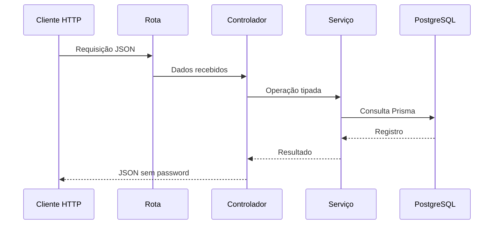

# 03 · Rotas, controladores e serviços

[← Anterior](02-modelagem-e-sincronizacao-com-prisma.md) · [Índice](../README.md) · **Etapa 3 de 11** · [Próxima →](04-validacao-de-dados-com-zod.md)

## Resultado desta etapa

CRUD de usuários, respostas sem hash de senha e tratamento central de erros. Todos os arquivos abaixo são completos: crie as pastas e substitua o arquivo quando ele já existir.

> [!WARNING]
> Até o capítulo 5, as rotas de usuários estão sem autenticação. Execute apenas localmente com dados de teste. O capítulo 5 restringe consultas, atualização e exclusão à própria conta.



## 1. Definir erros da aplicação

<!-- file: src/lib/http-error.ts -->
```typescript
export class HttpError extends Error {
  constructor(public readonly status: number, message: string) {
    super(message);
  }
}
```

<!-- file: src/middlewares/error.middleware.ts -->
```typescript
import type { ErrorRequestHandler } from 'express';
import { HttpError } from '../lib/http-error.js';

export const errorHandler: ErrorRequestHandler = (error: unknown, _req, res, next) => {
  if (res.headersSent) return next(error);
  if (error instanceof HttpError) {
    res.status(error.status).json({ error: error.message });
    return;
  }
  if (typeof error === 'object' && error !== null && 'sqlState' in error && error.sqlState === '23505') {
    res.status(409).json({ error: 'Este e-mail já está em uso.' });
    return;
  }
  if (typeof error === 'object' && error !== null && 'status' in error) {
    if (error.status === 400) {
      res.status(400).json({ error: 'JSON inválido.' });
      return;
    }
    if (error.status === 413) {
      res.status(413).json({ error: 'Corpo da requisição muito grande.' });
      return;
    }
  }
  console.error('Erro interno na API:', error);
  res.status(500).json({ error: 'Erro interno do servidor.' });
};
```

Express 5 encaminha rejeições de controladores `async` ao middleware de erros. Falhas de banco não devem ser expostas no JSON da resposta. A violação de unicidade do PostgreSQL usa `sqlState: '23505'` tanto no cadastro quanto na atualização.

## 2. Criar o serviço

<!-- file: src/services/user.service.ts -->
```typescript
import bcrypt from 'bcrypt';
import { db } from '../prisma/db.js';
import { HttpError } from '../lib/http-error.js';

export interface CreateUserInput {
  email: string;
  password: string;
  name?: string;
}
export type UpdateUserInput = Partial<CreateUserInput>;
type UserRow = Awaited<ReturnType<typeof db.orm.public.User.create>>;

export const toPublicUser = (user: UserRow) => ({
  id: user.id,
  email: user.email,
  name: user.name,
  createdAt: user.createdAt,
});

export class UserService {
  static async createUser(data: CreateUserInput) {
    return db.orm.public.User.create({
      email: data.email,
      name: data.name ?? null,
      password: await bcrypt.hash(data.password, 12),
    });
  }

  static async getAllUsers() {
    return db.orm.public.User.all();
  }

  static async getUserById(id: number) {
    const user = await db.orm.public.User.first({ id });
    if (!user) throw new HttpError(404, 'Usuário não encontrado.');
    return user;
  }

  static async updateUser(id: number, data: UpdateUserInput) {
    const changes: UpdateUserInput = {};
    if (data.name !== undefined) changes.name = data.name;
    if (data.email !== undefined) changes.email = data.email;
    if (data.password !== undefined) changes.password = await bcrypt.hash(data.password, 12);
    if (Object.keys(changes).length === 0) throw new HttpError(400, 'Informe pelo menos um campo.');
    const user = await db.orm.public.User.where({ id }).update(changes);
    if (!user) throw new HttpError(404, 'Usuário não encontrado.');
    return user;
  }

  static async deleteUser(id: number) {
    const user = await db.orm.public.User.where({ id }).delete();
    if (!user) throw new HttpError(404, 'Usuário não encontrado.');
  }
}
```

A atualização envia apenas `name`, `email` e `password`, e não todo o corpo recebido. `id` e `createdAt` não são editáveis. A operação retorna o registro atualizado ou `null`, dispensando uma consulta prévia sujeita a corrida.

## 3. Criar o controlador

<!-- file: src/controllers/user.controller.ts -->
```typescript
import type { Request, Response } from 'express';
import { UserService, toPublicUser } from '../services/user.service.js';
import { HttpError } from '../lib/http-error.js';

const readId = (req: Request) => {
  const value = String(req.params.id);
  const id = Number(value);
  if (!/^\d+$/.test(value) || !Number.isSafeInteger(id) || id < 1 || id > 2147483647) {
    throw new HttpError(400, 'ID deve ser um inteiro positivo válido.');
  }
  return id;
};

export class UserController {
  static async createUser(req: Request, res: Response) {
    const { email, password, name } = req.body ?? {};
    if (typeof email !== 'string' || typeof password !== 'string' || !email || !password) {
      throw new HttpError(400, 'E-mail e senha obrigatórios.');
    }
    const user = await UserService.createUser({ email, password, name });
    res.status(201).json(toPublicUser(user));
  }
  static async getAllUsers(_req: Request, res: Response) {
    res.json((await UserService.getAllUsers()).map(toPublicUser));
  }
  static async getUserById(req: Request, res: Response) {
    res.json(toPublicUser(await UserService.getUserById(readId(req))));
  }
  static async updateUser(req: Request, res: Response) {
    res.json(toPublicUser(await UserService.updateUser(readId(req), req.body ?? {})));
  }
  static async deleteUser(req: Request, res: Response) {
    await UserService.deleteUser(readId(req));
    res.status(204).send();
  }
}
```

## 4. Criar e conectar somente as rotas existentes

<!-- file: src/routes/user.route.ts -->
```typescript
import { Router } from 'express';
import { UserController } from '../controllers/user.controller.js';

const router = Router();
router.post('/users', UserController.createUser);
router.get('/users', UserController.getAllUsers);
router.get('/users/:id', UserController.getUserById);
router.put('/users/:id', UserController.updateUser);
router.delete('/users/:id', UserController.deleteUser);
export default router;
```

<!-- file: src/routes/index.ts -->
```typescript
import { Router } from 'express';
import userRoutes from './user.route.js';

const routes = Router();
routes.use(userRoutes);
export default routes;
```

Não há import de `cliente.route.ts`: esse recurso só será criado no capítulo 10.

Substitua `src/app.ts`:

<!-- file: src/app.ts -->
```typescript
import express from 'express';
import routes from './routes/index.js';
import { errorHandler } from './middlewares/error.middleware.js';

export const app = express();
app.use(express.json({ limit: '16kb' }));
app.get('/health', (_req, res) => res.json({ status: 'ok' }));
app.use(routes);
app.use((_req, res) => res.status(404).json({ error: 'Rota não encontrada.' }));
app.use(errorHandler);
```

Substitua `src/server.ts`. O servidor escuta HTTP; `app.ts` pode ser importado pelos testes sem abrir uma porta fixa.

<!-- file: src/server.ts -->
```typescript
import { app } from './app.js';
import { env } from './config/env.js';
import { db } from './prisma/db.js';

const server = app.listen(env.PORT, () => {
  console.log(`API disponível em http://localhost:${env.PORT}`);
});
const shutdown = () => {
  server.close(() => {
    void db.close().then(() => process.exit(0)).catch(() => process.exit(1));
  });
};
process.once('SIGINT', shutdown);
process.once('SIGTERM', shutdown);
```

## 5. Testar o CRUD local

```bat
npm run typecheck
npm run dev
```

Em outro CMD, cadastre um usuário:

```bat
curl.exe -i -H "Content-Type: application/json" -d "{\"email\":\"teste@example.com\",\"password\":\"Teste123!\",\"name\":\"Pessoa Teste\"}" http://localhost:3000/users
curl.exe -i http://localhost:3000/users
```

Anote o `id` devolvido. Os exemplos seguintes usam `1`; substitua pelo ID real.

```bat
curl.exe -i http://localhost:3000/users/1
curl.exe -i -X PUT -H "Content-Type: application/json" -d "{\"name\":\"Nome Alterado\"}" http://localhost:3000/users/1
curl.exe -i -X DELETE http://localhost:3000/users/1
curl.exe -i http://localhost:3000/users/1
```

| Operação | Resultado esperado |
|---|---|
| Cadastro | 201, sem `password` |
| E-mail repetido antes da exclusão | 409 |
| Listagem/consulta/edição | 200, sem `password` |
| ID textual, negativo, zero ou fora de `Int` | 400 |
| Exclusão | 204, sem corpo |
| Consulta após exclusão | 404 |

## Conferência antes de avançar

- [ ] Projeto compila; nenhuma rota inexistente foi importada.
- [ ] CRUD testado com um usuário descartável.
- [ ] Hash de senha ausente em todas as respostas.
- [ ] Erros públicos não revelam SQL, credenciais ou stack.

Referência: [erros no Express](https://expressjs.com/en/guide/error-handling.html).

[← Anterior](02-modelagem-e-sincronizacao-com-prisma.md) · [04 · Validação →](04-validacao-de-dados-com-zod.md)
