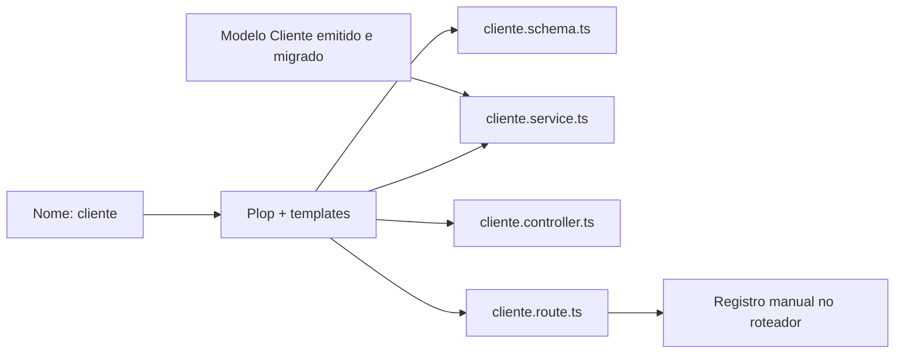

<!-- Documento: docs/10-automacao-e-geracao-de-codigo.md -->

# 10 · Gerar um recurso completo com Plop

[← Anterior](09-testes-automatizados-vitest.md) · [Índice](../README.md) · **Etapa 10 de 11** · [Próxima →](11-validacao-ponta-a-ponta.md)

**Ponto de partida:** conclua o capítulo anterior antes de continuar. Todos os caminhos abaixo partem da raiz da sua API, a pasta que contém `package.json`. Crie as subpastas indicadas no editor quando ainda não existirem.

## Resultado desta etapa

Um gerador ESM que cria **schema de validação, serviço, controlador e rotas** para um recurso de contatos. O exemplo é `Cliente`, com CRUD protegido por autenticação e documentação OpenAPI.

> **📌 Importante**
>
> Este gerador é específico para modelos com `id`, `name`, `email` e `createdAt`, como o `Cliente` abaixo. Não gera automaticamente campos arbitrários, modelo Prisma, migração ou regras de permissão. Contatos são um recurso compartilhado entre usuários autenticados neste exercício; contas `User` continuam limitadas ao próprio titular.



## 1. Instalar o Plop e acrescentar o script

**Propósito do passo:** Plop cria arquivos a partir de modelos de texto. Vamos usá-lo para repetir a organização que já construímos manualmente, sem copiar e renomear cada arquivo por conta própria.

```bat
REM Execute no CMD, na raiz da sua API (pasta que contém package.json).
npm install -D --save-exact plop@4.0.5
```

Acrescente ao objeto `scripts` de `package.json`:

**Arquivo: `package.json` — somente o valor do campo `scripts`.**

Este trecho é JSON: mantenha o caminho de identificação fora do código, pois `package.json` não aceita comentários. Preserve as dependências e os outros campos do arquivo.

<!-- scripts -->
```json
{
  "generate": "plop"
}
```

Preserve `dev`, `build`, `start` e todos os scripts de teste. O projeto já é ESM desde o capítulo 1, então `plopfile.js` pode usar `export default`.

## 2. Definir o modelo antes de gerar o código

**Propósito do passo:** Gerar arquivos TypeScript não cria tabelas. Primeiro precisamos definir Cliente, emitir seus tipos e aplicar a migração, para que o serviço gerado encontre uma estrutura existente.

Substitua `src/prisma/contract.prisma` pelo conteúdo completo abaixo, preservando `User`:

**Arquivo: `src/prisma/contract.prisma`**

Substitua todo o conteúdo do arquivo existente. Descreve os modelos do banco. Preserve a primeira linha // use prisma-8: ela permite que o Prisma reconheça este contrato.

<!-- file: src/prisma/contract.prisma -->
```prisma
// use prisma-8
// Arquivo: src/prisma/contract.prisma

model User {
  id        Int      @id @default(autoincrement())
  email     String   @unique
  name      String?
  password  String
  createdAt DateTime @default(now())
}

model Cliente {
  id        Int      @id @default(autoincrement())
  name      String
  email     String   @unique
  createdAt DateTime @default(now())
}
```

```bat
REM Execute no CMD, na raiz da sua API (pasta que contém package.json).
npm run contract:emit
npx prisma migration plan --name add_clientes
```

Revise o plano: deve acrescentar `Cliente`, mantendo `User`. Se ele propuser recriar `User`, confira a referência `db` e a aplicação da migração anterior antes de continuar.

```bat
REM Execute no CMD, na raiz da sua API (pasta que contém package.json).
npx prisma db migrate --advance-ref db
npx prisma db verify
```

## 3. Criar os quatro templates

**Propósito do passo:** Um template é um modelo com espaços que serão preenchidos pelo gerador. Os marcadores entre chaves representam o nome do recurso em diferentes formatos.

Crie a pasta `plop-templates` na raiz. Copie cada bloco para o arquivo indicado, preservando os marcadores `{{...}}`.

Os arquivos terminam em `.hbs` porque são templates Handlebars, o formato de texto usado pelo Plop. Por exemplo, para `cliente`, `camelCase` produz `cliente` e `pascalCase` produz `Cliente`. Não troque essas chaves manualmente no template: o gerador fará a substituição e gravará o caminho no comentário do arquivo gerado.

### `plop-templates/schema.ts.hbs`

**Arquivo: `plop-templates/schema.ts.hbs`**

Crie este arquivo e copie todo o conteúdo abaixo. Modelo de validação: o Plop preenche o nome e grava o schema do recurso na pasta src/schemas.

<!-- file: plop-templates/schema.ts.hbs -->
```handlebars
{{!-- Arquivo: plop-templates/schema.ts.hbs --}}
// Arquivo: src/schemas/{{camelCase name}}.schema.ts
import { z } from 'zod';
import { idParams } from '../schemas/user.schema.js';

export const create{{pascalCase name}}Body = z.object({
  name: z.string().trim().min(2).max(100),
  email: z.string().trim().toLowerCase().max(254).pipe(z.email()),
}).strict();
export const update{{pascalCase name}}Body = create{{pascalCase name}}Body.partial().refine(
  value => Object.keys(value).length > 0, 'Informe pelo menos um campo.',
);
export const create{{pascalCase name}}Schema = z.object({ body: create{{pascalCase name}}Body });
export const update{{pascalCase name}}Schema = z.object({ body: update{{pascalCase name}}Body, params: idParams });
export const {{camelCase name}}IdSchema = z.object({ params: idParams });
export type Create{{pascalCase name}}Input = z.infer<typeof create{{pascalCase name}}Body>;
export type Update{{pascalCase name}}Input = z.infer<typeof update{{pascalCase name}}Body>;
```

### `plop-templates/service.ts.hbs`

**Arquivo: `plop-templates/service.ts.hbs`**

Crie este arquivo e copie todo o conteúdo abaixo. Modelo de serviço: o Plop preenche o nome do modelo e grava as operações de banco na pasta src/services.

<!-- file: plop-templates/service.ts.hbs -->
```handlebars
{{!-- Arquivo: plop-templates/service.ts.hbs --}}
// Arquivo: src/services/{{camelCase name}}.service.ts
import { db } from '../prisma/db.js';
import { HttpError } from '../lib/http-error.js';
import type { Create{{pascalCase name}}Input, Update{{pascalCase name}}Input } from '../schemas/{{camelCase name}}.schema.js';

export class {{pascalCase name}}Service {
  static async create(data: Create{{pascalCase name}}Input) {
    return db.orm.public.{{pascalCase name}}.create({ name: data.name, email: data.email });
  }
  static async getAll() {
    return db.orm.public.{{pascalCase name}}.all();
  }
  static async getById(id: number) {
    const record = await db.orm.public.{{pascalCase name}}.first({ id });
    if (!record) throw new HttpError(404, '{{pascalCase name}} não encontrado.');
    return record;
  }
  static async update(id: number, data: Update{{pascalCase name}}Input) {
    const record = await db.orm.public.{{pascalCase name}}.where({ id }).update(data);
    if (!record) throw new HttpError(404, '{{pascalCase name}} não encontrado.');
    return record;
  }
  static async delete(id: number) {
    const record = await db.orm.public.{{pascalCase name}}.where({ id }).delete();
    if (!record) throw new HttpError(404, '{{pascalCase name}} não encontrado.');
  }
}
```

### `plop-templates/controller.ts.hbs`

**Arquivo: `plop-templates/controller.ts.hbs`**

Crie este arquivo e copie todo o conteúdo abaixo. Modelo de controlador: o Plop conecta o serviço e grava as respostas HTTP na pasta src/controllers.

<!-- file: plop-templates/controller.ts.hbs -->
```handlebars
{{!-- Arquivo: plop-templates/controller.ts.hbs --}}
// Arquivo: src/controllers/{{camelCase name}}.controller.ts
import type { Request, Response } from 'express';
import { {{pascalCase name}}Service } from '../services/{{camelCase name}}.service.js';

export class {{pascalCase name}}Controller {
  static async create(req: Request, res: Response) {
    res.status(201).json(await {{pascalCase name}}Service.create(req.body));
  }
  static async getAll(_req: Request, res: Response) {
    res.json(await {{pascalCase name}}Service.getAll());
  }
  static async getById(req: Request, res: Response) {
    res.json(await {{pascalCase name}}Service.getById(Number(req.params.id)));
  }
  static async update(req: Request, res: Response) {
    res.json(await {{pascalCase name}}Service.update(Number(req.params.id), req.body));
  }
  static async delete(req: Request, res: Response) {
    await {{pascalCase name}}Service.delete(Number(req.params.id));
    res.status(204).send();
  }
}
```

### `plop-templates/route.ts.hbs`

**Arquivo: `plop-templates/route.ts.hbs`**

Crie este arquivo e copie todo o conteúdo abaixo. Modelo de rotas: o Plop grava validação, autenticação e comentários Swagger na pasta src/routes.

<!-- file: plop-templates/route.ts.hbs -->
```handlebars
{{!-- Arquivo: plop-templates/route.ts.hbs --}}
// Arquivo: src/routes/{{camelCase name}}.route.ts
import { Router } from 'express';
import { {{pascalCase name}}Controller } from '../controllers/{{camelCase name}}.controller.js';
import { authMiddleware } from '../middlewares/auth.middleware.js';
import { validate } from '../middlewares/validate.middleware.js';
import { create{{pascalCase name}}Schema, update{{pascalCase name}}Schema, {{camelCase name}}IdSchema } from '../schemas/{{camelCase name}}.schema.js';

/**
 * @openapi
 * components:
 *   schemas:
 *     {{pascalCase name}}Input:
 *       type: object
 *       additionalProperties: false
 *       required: [name, email]
 *       properties:
 *         name: { type: string, minLength: 2, maxLength: 100 }
 *         email: { type: string, format: email, maxLength: 254 }
 *     {{pascalCase name}}Update:
 *       type: object
 *       additionalProperties: false
 *       minProperties: 1
 *       properties:
 *         name: { type: string, minLength: 2, maxLength: 100 }
 *         email: { type: string, format: email, maxLength: 254 }
 * /{{camelCase name}}s:
 *   post:
 *     summary: Criar {{camelCase name}}
 *     tags: [{{pascalCase name}}]
 *     requestBody:
 *       required: true
 *       content:
 *         application/json:
 *           schema: { $ref: '#/components/schemas/{{pascalCase name}}Input' }
 *     responses:
 *       '201': { description: Registro criado. }
 *       '400': { description: Dados inválidos. }
 *       '401': { description: Token ausente ou inválido. }
 *       '409': { description: E-mail já utilizado. }
 *   get:
 *     summary: Listar contatos compartilhados
 *     tags: [{{pascalCase name}}]
 *     responses:
 *       '200': { description: Lista de registros. }
 *       '401': { description: Token ausente ou inválido. }
 * /{{camelCase name}}s/{id}:
 *   parameters:
 *     - in: path
 *       name: id
 *       required: true
 *       schema: { type: integer, minimum: 1, maximum: 2147483647 }
 *   get:
 *     summary: Consultar {{camelCase name}}
 *     tags: [{{pascalCase name}}]
 *     responses:
 *       '200': { description: Registro encontrado. }
 *       '400': { description: ID inválido. }
 *       '401': { description: Token ausente ou inválido. }
 *       '404': { description: Registro inexistente. }
 *   put:
 *     summary: Atualizar {{camelCase name}}
 *     tags: [{{pascalCase name}}]
 *     requestBody:
 *       required: true
 *       content:
 *         application/json:
 *           schema: { $ref: '#/components/schemas/{{pascalCase name}}Update' }
 *     responses:
 *       '200': { description: Registro atualizado. }
 *       '400': { description: Dados inválidos. }
 *       '401': { description: Token ausente ou inválido. }
 *       '403': { description: Origem de cookie não permitida. }
 *       '404': { description: Registro inexistente. }
 *       '409': { description: E-mail já utilizado. }
 *   delete:
 *     summary: Excluir {{camelCase name}}
 *     tags: [{{pascalCase name}}]
 *     responses:
 *       '204': { description: Registro excluído, sem corpo. }
 *       '400': { description: ID inválido. }
 *       '401': { description: Token ausente ou inválido. }
 *       '403': { description: Origem de cookie não permitida. }
 *       '404': { description: Registro inexistente. }
 */
const router = Router();
router.use('/{{camelCase name}}s', authMiddleware);
router.post('/{{camelCase name}}s', validate(create{{pascalCase name}}Schema), {{pascalCase name}}Controller.create);
router.get('/{{camelCase name}}s', {{pascalCase name}}Controller.getAll);
router.get('/{{camelCase name}}s/:id', validate({{camelCase name}}IdSchema), {{pascalCase name}}Controller.getById);
router.put('/{{camelCase name}}s/:id', validate(update{{pascalCase name}}Schema), {{pascalCase name}}Controller.update);
router.delete('/{{camelCase name}}s/:id', validate({{camelCase name}}IdSchema), {{pascalCase name}}Controller.delete);
export default router;
```

## 4. Criar `plopfile.js`

**Propósito do passo:** Este arquivo liga os templates aos caminhos de saída e define a pergunta feita ao executar o gerador. Assim, informar cliente produz os quatro arquivos correspondentes.

**Arquivo: `plopfile.js`**

Crie este arquivo e copie todo o conteúdo abaixo. Define a pergunta e os quatro arquivos que o Plop cria ao receber o nome do recurso.

<!-- file: plopfile.js -->
```javascript
// Arquivo: plopfile.js
export default function (plop) {
  plop.setGenerator('recurso', {
    description: 'Gera schema, serviço, controlador e rotas para um contato.',
    prompts: [{
      type: 'input',
      name: 'name',
      message: 'Nome singular em minúsculas, sem acentos (ex.: cliente):',
      validate: value => /^[a-z]+$/.test(value) || 'Use somente letras minúsculas, sem espaços ou acentos.',
    }],
    actions: [
      { type: 'add', path: 'src/schemas/{{camelCase name}}.schema.ts', templateFile: 'plop-templates/schema.ts.hbs' },
      { type: 'add', path: 'src/services/{{camelCase name}}.service.ts', templateFile: 'plop-templates/service.ts.hbs' },
      { type: 'add', path: 'src/controllers/{{camelCase name}}.controller.ts', templateFile: 'plop-templates/controller.ts.hbs' },
      { type: 'add', path: 'src/routes/{{camelCase name}}.route.ts', templateFile: 'plop-templates/route.ts.hbs' },
    ],
  });
}
```

## 5. Gerar `cliente` e registrar as rotas

**Propósito do passo:** Vamos executar o gerador uma única vez e depois registrar a rota criada. Essa ordem evita importar um arquivo que ainda não existe.

```bat
REM Execute no CMD, na raiz da sua API (pasta que contém package.json).
npm run generate
```

Escolha **recurso**, se houver seleção, e informe **cliente**. Alternativamente, passe a resposta pela linha de comando:

```bat
REM Execute no CMD, na raiz da sua API (pasta que contém package.json).
npm run generate -- recurso cliente
```

Use **apenas uma** dessas formas. O Plop deve criar quatro arquivos. Não gere `cliente` novamente sobre os mesmos arquivos; a recusa de sobrescrita é esperada. Se uma geração falhar parcialmente, confira quais arquivos foram criados antes de tentar outra vez.

**Arquivo: `src/routes/index.ts`**

Substitua todo o conteúdo do arquivo existente. Reúne as rotas já criadas e as disponibiliza para app.ts. Só importe aqui um arquivo que já exista.

<!-- file: src/routes/index.ts -->
```typescript
// Arquivo: src/routes/index.ts
import { Router } from 'express';
import userRoutes from './user.route.js';
import authRoutes from './auth.route.js';
import clienteRoutes from './cliente.route.js';

const routes = Router();
routes.use(userRoutes);
routes.use(authRoutes);
routes.use(clienteRoutes);
export default routes;
```

Agora o import de `cliente.route.js` aponta para um arquivo realmente criado.

## 6. Criar testes para o recurso gerado

**Propósito do passo:** Os arquivos gerados também precisam ser conferidos. Vamos acrescentar testes de clientes e manter os testes de usuários, para verificar os dois recursos juntos.

Crie `tests/cliente.test.ts` após gerar os arquivos. Esses seis testes usam o banco substituído e complementam os 17 testes de usuários.

**Arquivo: `tests/cliente.test.ts`**

Crie este arquivo e copie todo o conteúdo abaixo. Confere seis situações do recurso Cliente sem acessar o banco real, complementando os testes de usuários.

<!-- file: tests/cliente.test.ts -->
```typescript
// Arquivo: tests/cliente.test.ts
import { beforeEach, expect, it, vi } from 'vitest';
import request from 'supertest';
import jwt from 'jsonwebtoken';

const contacts = vi.hoisted(() => ({
  create: vi.fn(), first: vi.fn(), all: vi.fn(), update: vi.fn(), delete: vi.fn(),
}));
vi.mock('../src/prisma/db.js', () => ({
  db: { orm: { public: {
    User: {},
    Cliente: {
      create: contacts.create, first: contacts.first, all: contacts.all,
      where: () => ({ update: contacts.update, delete: contacts.delete }),
    },
  } } },
}));
import { app } from '../src/app.js';
import { env } from '../src/config/env.js';

const record = { id: 1, name: 'Cliente Exemplo', email: 'cliente@example.com', createdAt: new Date('2026-01-01T00:00:00Z') };
const bearer = () => `Bearer ${jwt.sign({ id: 1 }, env.JWT_SECRET, {
  algorithm: 'HS256', expiresIn: '15m', issuer: 'express-tutorial', audience: 'express-api',
})}`;
beforeEach(() => {
  vi.resetAllMocks();
  contacts.create.mockImplementation(async data => ({ ...record, ...data }));
  contacts.first.mockResolvedValue(record);
  contacts.all.mockResolvedValue([record]);
  contacts.update.mockImplementation(async data => ({ ...record, ...data }));
  contacts.delete.mockResolvedValue(record);
});

it('bloqueia contato sem token antes do banco', async () => {
  expect((await request(app).get('/clientes')).status).toBe(401);
  expect(contacts.all).not.toHaveBeenCalled();
});
it('cria contato com e-mail normalizado', async () => {
  const result = await request(app).post('/clientes').set('Authorization', bearer()).send({ name: 'Cliente Exemplo', email: ' CLIENTE@EXAMPLE.COM ' });
  expect(result.status).toBe(201);
  expect(result.body.email).toBe(record.email);
  expect(contacts.create).toHaveBeenCalledWith({ name: record.name, email: record.email });
});
it('lista, consulta, atualiza e exclui contato autenticado', async () => {
  expect((await request(app).get('/clientes').set('Authorization', bearer())).body).toHaveLength(1);
  expect((await request(app).get('/clientes/1').set('Authorization', bearer())).status).toBe(200);
  const updated = await request(app).put('/clientes/1').set('Authorization', bearer()).send({ name: 'Nome Novo' });
  expect(updated.status).toBe(200);
  expect(updated.body.name).toBe('Nome Novo');
  expect((await request(app).delete('/clientes/1').set('Authorization', bearer())).status).toBe(204);
});
it('rejeita campo extra, edição vazia e ID inválido', async () => {
  expect((await request(app).post('/clientes').set('Authorization', bearer()).send({ name: 'Cliente', email: record.email, id: 99 })).status).toBe(400);
  expect((await request(app).put('/clientes/1').set('Authorization', bearer()).send({})).status).toBe(400);
  expect((await request(app).get('/clientes/abc').set('Authorization', bearer())).status).toBe(400);
});
it('retorna 409 em duplicidade e 404 em registro inexistente', async () => {
  contacts.create.mockRejectedValue({ sqlState: '23505' });
  expect((await request(app).post('/clientes').set('Authorization', bearer()).send({ name: record.name, email: record.email })).status).toBe(409);
  contacts.first.mockResolvedValue(null);
  expect((await request(app).get('/clientes/1').set('Authorization', bearer())).status).toBe(404);
});
it('inclui CRUD de contatos no OpenAPI', async () => {
  const result = await request(app).get('/api-docs.json');
  expect(result.body.paths['/clientes'].post).toBeDefined();
  expect(result.body.paths['/clientes/{id}'].put).toBeDefined();
  expect(result.body.paths['/clientes/{id}'].delete).toBeDefined();
});

```

## 7. Conferir geração, compilação e regressões

**Propósito do passo:** Vamos confirmar que a geração não quebrou os recursos anteriores e testar os contatos no banco real. Os novos caminhos também precisam aparecer na página Swagger.

```bat
REM Execute no CMD, na raiz da sua API (pasta que contém package.json).
npm run typecheck
npm test
npm run build
```

Se o servidor estiver parado, execute `npm run dev` no primeiro CMD e deixe-o aberto. **Faça um novo login antes de testar clientes:** o token do capítulo 5 dura 15 minutos e pode ter expirado enquanto você fazia os outros capítulos. Use `POST /login` no Swagger com a conta que criou, copie o novo token e repita **Authorize**. Se excluiu essa conta, cadastre outra primeiro.

Para usar o CMD, defina `TOKEN` com esse novo token no segundo terminal, como no capítulo 5. A variável pertence somente ao terminal em que você a definiu. Agora teste o CRUD de clientes:

```bat
REM Execute no CMD, na raiz da sua API (pasta que contém package.json).
set TOKEN=COLE_UM_TOKEN_VALIDO
curl.exe -i -H "Authorization: Bearer %TOKEN%" -H "Content-Type: application/json" -d "{\"name\":\"Cliente Exemplo\",\"email\":\"cliente@example.com\"}" http://localhost:3000/clientes
curl.exe -i -H "Authorization: Bearer %TOKEN%" http://localhost:3000/clientes
```

Anote o ID criado; substitua `1` nos próximos exemplos:

```bat
REM Execute no CMD, na raiz da sua API (pasta que contém package.json).
curl.exe -i -H "Authorization: Bearer %TOKEN%" http://localhost:3000/clientes/1
curl.exe -i -X PUT -H "Authorization: Bearer %TOKEN%" -H "Content-Type: application/json" -d "{\"name\":\"Cliente Atualizado\"}" http://localhost:3000/clientes/1
curl.exe -i -X DELETE -H "Authorization: Bearer %TOKEN%" http://localhost:3000/clientes/1
```

Espere 201, 200, 200, 200 e 204. Sem token, `/clientes` deve retornar 401. Repetir um e-mail existente retorna 409; consultar um contato removido retorna 404. Verifique `/clientes` e `/clientes/{id}` em `/api-docs.json`, tanto no desenvolvimento quanto após o build.

> **ℹ️ Observação**
>
> Agora `npm test` deve aprovar **23 testes**: 17 de usuários e seis do recurso gerado. Com banco real, aplique `add_clientes` ao banco de testes antes de novos cenários. O teste de integração de usuários também pode ser reexecutado após aplicar a nova migração ao banco de testes.

## Conferência antes de avançar

- [ ] Modelo `Cliente` emitido e migrado antes do uso das rotas.
- [ ] Quatro arquivos gerados, com imports `.js`.
- [ ] Rotas registradas somente após a geração.
- [ ] CRUD de contatos autenticado e testado; e-mail único respeitado.
- [ ] Swagger inclui as rotas geradas.
- [ ] Testes anteriores e build continuam aprovados.

Referência: [documentação do Plop](https://plopjs.com/documentation/).

[← Anterior](09-testes-automatizados-vitest.md) · [11 · Validação final →](11-validacao-ponta-a-ponta.md)
