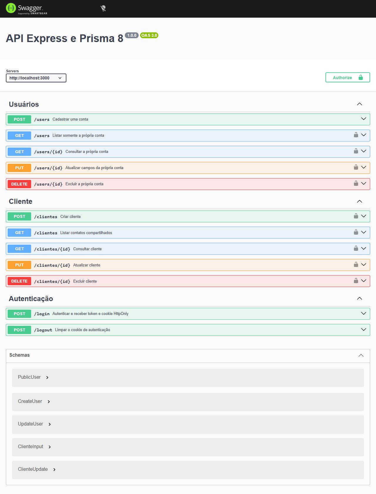

# Registro de validação da documentação

[← Índice](../README.md) · [Lista para repetir a aprovação](11-validacao-ponta-a-ponta.md) · [Evidências em JSON](evidencias/2026-10-02-api5.json)

**Data:** 2 de outubro de 2026. **Resultado:** os onze capítulos passaram em sequência na tentativa `api5`, com banco real e navegador.

> [!NOTE]
> Esta aprovação descreve uma execução nas versões abaixo. Não é uma garantia de ausência de bugs em qualquer ambiente ou versão futura. A aplicação antiga do repositório não foi convertida: a API validada foi construída em uma pasta nova seguindo o guia.

## Método e ambiente

Os comandos CMD foram executados na ordem dos capítulos. Os blocos de arquivos foram copiados literalmente do Markdown, e os scripts foram acumulados conforme as instruções. Ao final, os **40 arquivos identificados no guia** foram comparados com os arquivos executados, sem diferenças.

A conexão fornecida em `api/.env` foi usada para criar dois bancos vazios e exclusivos desta tentativa. A pasta `api`, suas credenciais e suas tabelas foram preservadas. Cada ambiente recebeu uma chave JWT aleatória de 64 caracteres. O `.env.example` usado corresponde ao [modelo público do projeto](../.env.example); ele não contém credenciais reais.

| Ambiente | Versão ou condição |
|---|---|
| Node.js / npm | 24.15.0 / 11.12.1 |
| PostgreSQL | 18.6; TLS confirmado no socket do cliente |
| TypeScript | 5.9.3; ESM e NodeNext |
| Prisma CLI / CLI engine | 8.0.0-rc.15 / 0.4.0 |
| ORM PostgreSQL | 8.0.0-rc.11 |
| Temporal | `temporal-polyfill@1.0.5`, carregado antes das consultas |
| Vitest / coverage-v8 | 4.1.11 |
| Plop | 4.0.5 |
| Navegador | Microsoft Edge instalado; automação externa à API |
| Desenvolvimento | `express_t13_api5_dev_20261002` |
| Integração | `express_t13_api5_test_20261002` |

## Falha encontrada e repetição

| Tentativa | Resultado |
|---|---|
| `api2` | Preparação interrompida por restrição de rede do executor |
| `api3` | Inicialização e primeira migração passaram; erro de escape de CMD na automação foi corrigido |
| `api4` | Falha real no capítulo 3: cadastro retornou 500 por ausência de Temporal no Node.js 24 |
| `api5` | Reinício completo com a documentação corrigida; capítulos 1 a 11 aprovados |

A falha de `api4` não aparecia no build nem em `/health`: a consulta gravava o usuário, mas falhava ao decodificar `createdAt`. Foram acrescentados o pacote de execução e o import `temporal-polyfill/full/global` aos capítulos 1 e 2, além das explicações e do diagnóstico. A validação inteira foi repetida, sem aproveitar os arquivos ou migrações de `api4`.

As pastas anteriores foram mantidas para diagnóstico. Seus bancos podem conter estruturas parciais; não são o ambiente aprovado.

## Resultado por capítulo

| Etapa | Resultado observado |
|---|---|
| 01 · Ambiente | Instalação das versões fixadas, inicialização Prisma e `/health` 200 |
| 02 · Banco | Contrato emitido, skills sincronizadas, primeira migração aplicada, `db verify`, status, typecheck e build aprovados |
| 03 · CRUD | Cadastro 201, consultas/atualização 200, exclusão 204, ausente 404 e duplicidade 409 no banco real |
| 04 · Zod | Entradas inválidas, campos extras, atualização vazia e senha acima de 72 bytes rejeitados; e-mail normalizado |
| 05 · JWT | Login, Bearer, cookie HttpOnly, acesso apenas à própria conta, verificação de origem e logout aprovados |
| 06 · Logs | JSON válido em arquivo, sem cores ANSI; autenticação e cookies preservados |
| 07 · Segurança | Helmet, preflight 204 e origem desconhecida 403; cinco logins inválidos 401 e sexto 429 |
| 08 · Swagger | Documento e interface disponíveis em TypeScript e JavaScript compilado |
| 09 · Testes | 17 testes sem banco; primeira migração e integração real aprovadas no banco separado |
| 10 · Gerador | Segunda migração aplicada; quatro arquivos gerados por Plop; CRUD real de Cliente e 23 testes aprovados |
| 11 · Validação | Integração repetida após a segunda migração, API compilada, instalação limpa e execução após `npm prune --omit=dev` aprovadas |

Os exemplos `curl.exe` foram executados com seus corpos e cabeçalhos documentados. IDs retornados foram usados nas chamadas seguintes, conforme a orientação do guia; o token foi passado em variável de ambiente, sem exposição nas evidências públicas.

## Verificações complementares

- ✅ Matriz final na API compilada: duplicidade, entrada inválida, autorização, JSON malformado 400 e corpo excessivo 413.
- ✅ Token ausente, inválido, expirado ou com emissor incorreto rejeitado com 401.
- ✅ Swagger no Edge: 12 operações, cadastro e login pelo **Try it out**, autorização pelo **Authorize** e Bearer confirmado na requisição.
- ✅ Frontend em `localhost:5173`: `credentials: 'include'`, leitura por cookie e atualização com origem enviada pelo navegador.
- ✅ Cookie HttpOnly ausente de `document.cookie`; logout removeu o cookie e o acesso posterior retornou 401.
- ✅ Limite geral: 100 requisições aceitas pelo limitador, a 101ª bloqueada com 429 e `/health` ainda respondendo 200.
- ✅ Logs sem senha de teste, JWT ou chave secreta; evidências sem URLs de conexão ou credenciais.
- ✅ UTF-8, acentos, `ç`, links locais e blocos Markdown conferidos.
- ✅ `.gitignore` conferido em repositório temporário: segredos e artefatos ignorados; `.env.example` permanece versionável.
- ✅ Zero usuários e zero clientes remanescentes nos dois bancos de `api5`, inclusive após os testes no navegador.
- ✅ Dependências de desenvolvimento restauradas com `npm ci` ao final.

O contrato original de `api`, com `Cliente`, `TelCliente`, `User` e `Teste`, também foi emitido em uma cópia isolada e conferido por `db verify`, sem migração ou assinatura no banco original. Ele corresponde à estrutura existente, mas seus campos de clientes diferem dos templates do tutorial. Essa diferença e o fluxo de adoção foram explicados no capítulo 2.

## Testes e cobertura

| Medida | Resultado |
|---|---|
| Testes sem banco | 23 aprovados, em dois arquivos |
| Integração real | Um teste aprovado nos capítulos 9 e 11 |
| Linhas | 95,28% |
| Statements | 91,94% |
| Branches | 79,20% |
| Funções | 95,65% |

A cobertura se refere ao conjunto medido pela configuração do capítulo 9, que exclui o runtime Prisma e o servidor. Não é uma medição da integração ou uma garantia de ausência de defeitos.

Imagem da interface Swagger validada

Captura antes de preencher credenciais ou autorizar; não contém token.

## Evidências e limites

O [registro público em JSON](evidencias/2026-10-02-api5.json) resume o ambiente, os capítulos, a navegação e a limpeza. Os registros completos permanecem na pasta local `api5`, em `VALIDACAO.json` e `VALIDACAO-NAVEGADOR.json`, com segredos removidos. As ferramentas de validação e de navegador ficaram fora das dependências da API.

Permanecem fora do escopo executado:

- Renderização final dos diagramas, alertas e imagens na página publicada do GitHub.
- Publicação com HTTPS, proxy, segredos do provedor e limites compartilhados entre instâncias.
- Adaptação do gerador aos campos e às relações do banco original de `api`.

Para repetir, use uma pasta e bancos novos, siga os capítulos e registre os resultados do [capítulo 11](11-validacao-ponta-a-ponta.md). Não considere aprovado um passo que não tenha sido executado.
